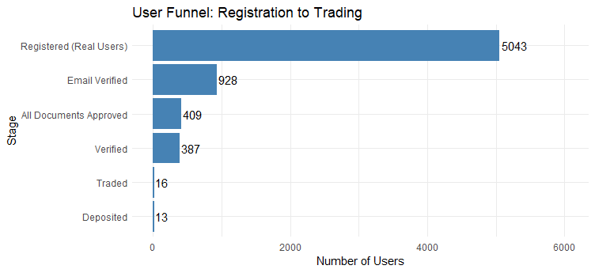
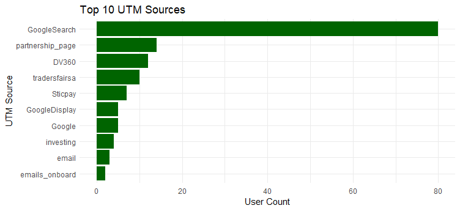
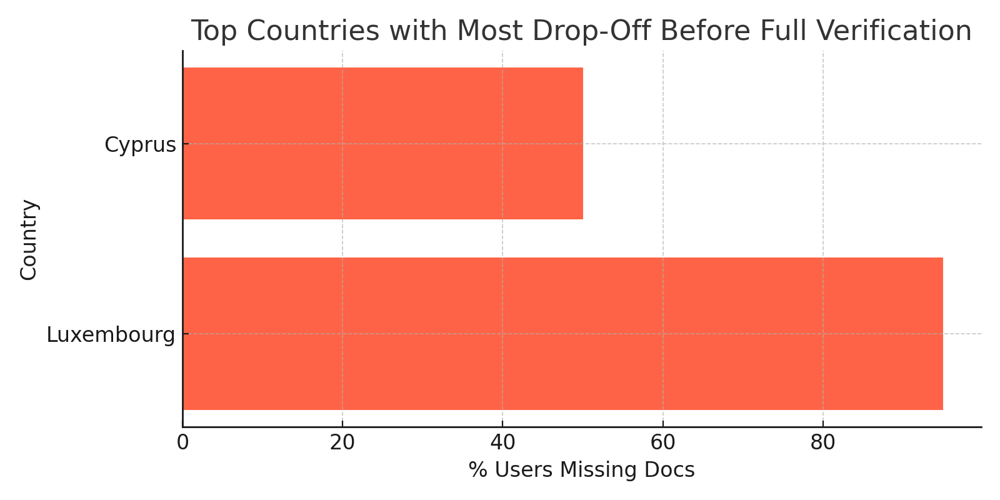
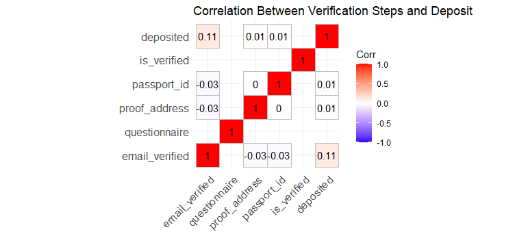

# -marketing-funnel-user-analysis
User funnel drop-off and verification analysis in R
# 📊 Marketing Funnel & User Behavior Analysis

**Author**: Hara Mitsidou  
**Tools**: R, dplyr, ggplot2, tidyr, ggcorrplot  
**Project Type**: Data Cleaning, Funnel Analytics, Anomaly Detection, Logistic Regression

---

## 📁 Project Overview

This project analyzes user onboarding behavior in a fintech mobile application. The dataset includes over 5,000 user accounts with details like verification status, document submissions, UTM sources, referral info, and user actions (deposit/trade).

The aim is to uncover funnel bottlenecks, understand what drives user conversion, and generate actionable business recommendations.

---

## 🎯 Objectives

- Clean and preprocess raw user data
- Identify drop-off points from registration to trading
- Detect anomalies and inconsistencies in user onboarding
- Visualize trends by country and acquisition channel
- Model verification behavior using logistic regression

---

## 🛠️ Process Overview

1. **Data Cleaning**: Converted binary and categorical fields, filtered out test users, handled missing values
2. **Anomaly Detection**: Verified users without documents, activity before registration, delayed verifications
3. **Funnel Analysis**: Tracked users across registration → email → verification → deposit → trading
4. **Visualizations**: Created plots for user registration trends, UTM performance, document submission
5. **Logistic Regression**: Modeled verification probability based on user features

---

## 📊 Sample Visuals










---

## 📈 Key Insights

- Only ~1% of users ended up depositing or trading.
- Largest drop-offs occurred at email verification and document submission.
- Users from South Africa and Vietnam had significantly higher verification odds.
- Certain UTM sources (e.g., GoogleDisplay, Email) performed poorly in driving verified users.
- Email verification had a weak but positive correlation with deposits.

---

## 🧠 Predictive Modeling

We fit a logistic regression model to predict whether a user would complete verification based on:
- Email verification
- Questionnaire completion
- Country
- UTM source

```r
glm(Is_Verified ~ Email_Verified + Questionnaire + Country + UTM_Source,
    data = model_data, family = binomial)
